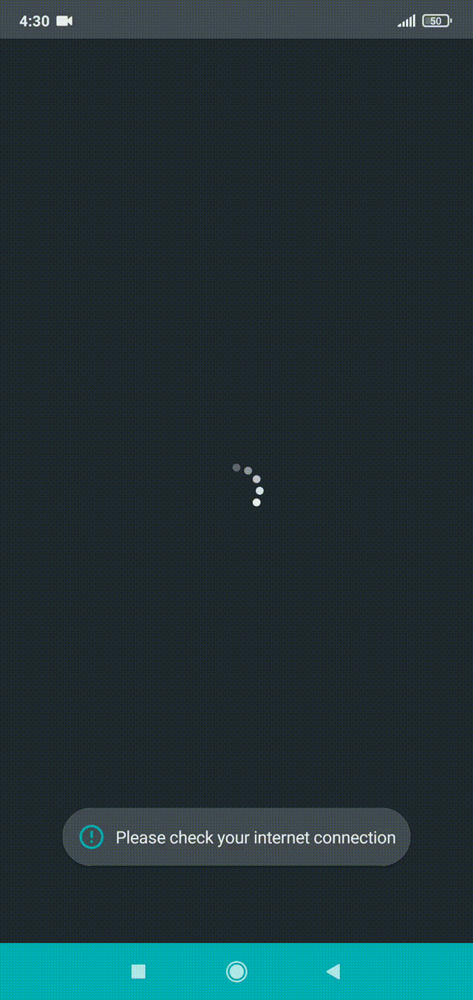
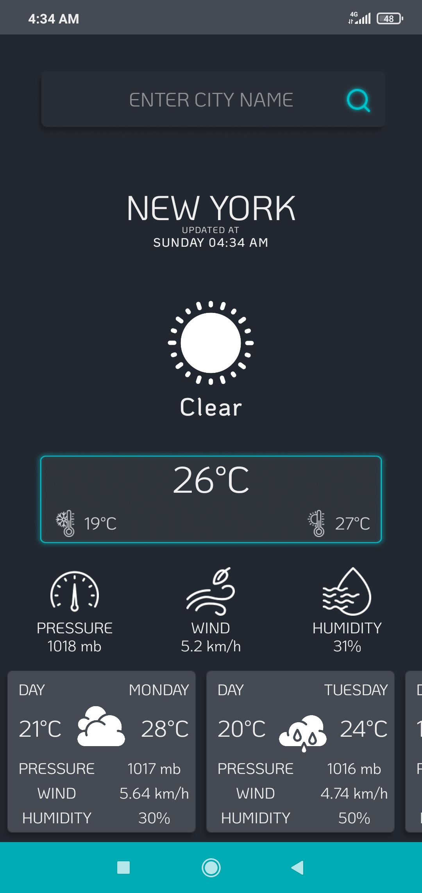
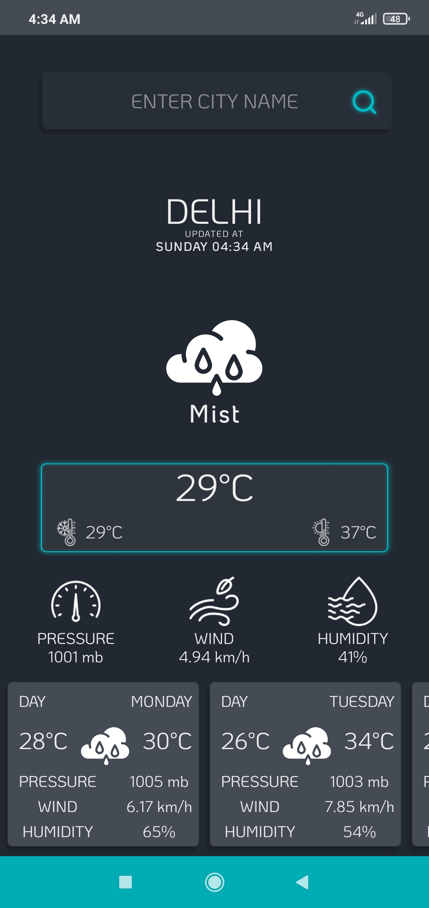

# Weather App

A simple, clean weather application for Android built in Java, providing current conditions and forecasts using the OpenWeatherMap API.

## Preview



## Screenshots

<p float="left">
  
  
</p>

## Features

- Current weather conditions for any location
- Minute-by-minute forecast for the next hour
- Hourly forecast for the next 48 hours
- Daily forecast for the next 8 days
- National weather alerts
- Access to historical weather data going back to January 1, 1979

## Data Source

This app uses the OpenWeatherMap One Call API to retrieve weather data in JSON format.

API documentation: https://openweathermap.org/api/one-call-3

## Setup

1. Create an account at https://openweathermap.org/
2. Generate a unique API key from your account dashboard
3. Open `LocationCord.java` and add your API key:

```java
public final static String API_KEY = "YOUR_API_KEY_HERE";
```

Note: OpenWeatherMap enforces rate limits per API key on free tier accounts. Review their pricing page if you expect heavy usage.

## Tech Stack

- Java
- Android SDK
- OpenWeatherMap One Call API

## Contributing

Contributions are welcome. Please fork the repository and submit a pull request. All contributions, whether bug fixes or new features, will be reviewed before merging.

## License

Specify a license for this project (for example, MIT) to clarify how others may use your code.

## Author

Bhagya Prasad Dannina (Pandu)
Portfolio: https://bhagyaprasad.dev
